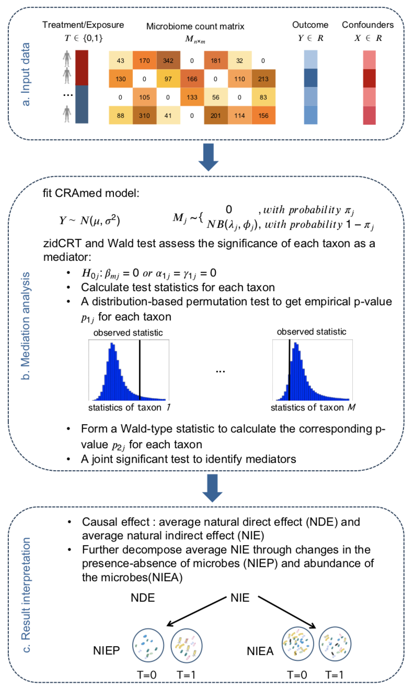

```{r, include = FALSE}
knitr::opts_chunk$set(
  collapse = TRUE,
  comment = "#>"
)
```
This is a practical tutorial on the use of CRAmed package, which introduces a mediation test for sparse and high-dimensional microbiome data. 

# A brief summary of the CRAmed
CRAmed uses a zero-inflated negative binomial (ZINB) distribution to model the microbiome count data obtained from 16S rRNA and metagenomic shotgun sequencing. The ZINB model naturally decomposes the total natural indirect effect (NIE) into two components. The first component, rep- resenting variations in the abundance of taxa, is captured by the negative binomial part of the model. The second component, representing the influence of the presence-absence of taxa, is captured by the zero-inflated part of the model. To account for the high dimensionality of microbiome data, CRAmed introduces a zero-inflated conditional randomization test (zidCRT). This approach enables us to identify the relevant taxa that act as causal mediators while controlling the false discovery rate. Finally, a joint significant test is emploied to identify the significant mediators. 


```{r demo-plot, out.width="70%", echo=FALSE,fig.cap="A schematic and outline of the CRAmed methodology for microbiome data."}

```
The overall workflow of CRAmed is shown in the figure above.

# Application of CRAmed: Infant data

The composition of newborns’ microbiome undergoes significant influence based on the mode of delivery (@mitchell2020delivery). Several studies have demonstrated that cesarean section (C-section) disrupts the succession of the newborn microbiome from the maternal birth canal and increases the risk of adverse health outcomes in offspring compared with vaginally delivered infants (@andersen2020caesarean,@korpela2020maternal,@zhou2023effects). Therefore, it is crucial to understand how the delivery mode influences the infant gut microbiome, which further mediates the phenotype of infants.

To identify the gut microbiome mediator between delivery mode and the infants’ weight, we apply our CRAmed and other methods to a publicly available dataset, coined DIABIUMMUNE (@yassour2016natural).
```{r}
library(CRAmed);library(phyloseq);library(pscl);#packageVersion("pscl") ‘1.5.5’
# Load data
data(Infant)
# remove missing values
Infant_sub <- subset_samples(Infant, !is.na(weight_growth_pace_during_three_years))
# filter out taxa with a prevalence of less than 10\%
prevdf <- apply(X = otu_table(Infant_sub),
                MARGIN = ifelse(taxa_are_rows(Infant_sub), yes = 1, no = 2),
                FUN = function(x){sum(x > 0)})
prevdf <- data.frame(Prevalence = prevdf,
                    TotalAbundance = taxa_sums(Infant_sub),
                    tax_table(Infant_sub))
prevalenceThreshold = floor(0.1* nsamples(Infant_sub))
keepTaxa <- rownames(prevdf)[(prevdf$Prevalence >= prevalenceThreshold)]
filter.infant <-  prune_taxa(keepTaxa, Infant_sub)
# metadata of Infant data
meta.infant <- sample_data(filter.infant)
# microbiome data
M_mat <- t((otu_table(filter.infant)@.Data))
# outcome
Y <- as.numeric(meta.infant$weight_growth_pace_during_year_one)
#treatment
trt <- ifelse(meta.infant$csection == TRUE, 1, 0)
```
To run `CRAmed` function, the minimum requirement is to provide `treatment`, `mediators`, and `outcome`. Note that if `CI=TRUE` and `n.perm=100` the function will cost several minutes to output the p-values calculated through permutation procedure. In order to save time, in the chunk below, we set `FDR = 0.05`, `n.times=10` (the number of times for sampling mediators from the ZINB model), `n.perm=10`(the number of times for sampling dataset for calculating confidence interval) and `CI=TRUE` in identifying mediators. 

```{r,warning=FALSE}
results.infant <- try(CRAmed(M_mat=as.matrix(M_mat), Y=Y, Exposure=as.matrix(trt), FDR = 0.05, n.times=10, n.perm=10, CI=TRUE))
results.infant
```
The output consists of several components:

 - `Mediators`: identified mediators
 - `NDE, NIE, NIEA, and NIEP`: corresponding natural direct effect, natural indirect effect, natural indirect effect mediated by the changes in the abundance, natural indirect effect mediated by the the presence status.
 - `NDE.pval, NIE.pval, NIEA.pval, and NIEP.pval`: the corresponding p-values of NDE, NIE, NIEA, and NIEP.
 - `NDE.CI, NIE.CI, NIEA.CI, and NIEP.CI`: the corresponding confidence interval of NDE, NIE, NIEA, and NIEP.

# Application of CRAmed: GGMP data
Numerous studies have underscored the profound influence antibiotics can exert on the composition of bacteria within the gut microbiome (@cho2012antibiotics,@fishbein2023antibiotic). We adopted a dataset from the Guangdong Gut Microbiome Project (GGMP), a large community-based cross-sectional cohort conducted between 2015 and 2016 including 7009 participants with high-quality gut microbiome data (@he2018regional). After preprocessing, we apply CRAmed to test whether the gut microbiota is a mediator that mediates the association between antibiotics and CMD-related risk factors.
```{r}
library(CRAmed)
# Load data
data(GGMP)
# filter out taxa with a prevalence of less than 10\%
prevdf <- apply(X = otu_table(GGMP),
                MARGIN = ifelse(taxa_are_rows(GGMP), yes = 1, no = 2),
                FUN = function(x){sum(x > 0)})
prevdf <- data.frame(Prevalence = prevdf,
                    TotalAbundance = taxa_sums(GGMP),
                    tax_table(GGMP))
prevalenceThreshold <- floor(0.1* nsamples(GGMP))
keepTaxa <- rownames(prevdf)[(prevdf$Prevalence >= prevalenceThreshold)]
filter.ggmp <- prune_taxa(keepTaxa, GGMP)
# metadata of GGMP data
meta.ggmp <- sample_data(filter.ggmp)
# microbiome data
M_mat <- t((otu_table(filter.ggmp)@.Data))
# outcome
Y <- as.numeric(unlist(meta.ggmp[,"BMI"]))
# treatment
trt <- ifelse(meta.ggmp$Antibiotics == "n", 1, 0)

```
To run `CRAmed` function, we also provide `treatment`, `mediators`, and `outcome`. 
```{r,warning=FALSE}
results.ggmp <-try(CRAmed(M_mat=as.matrix(M_mat[,1:20]), Y=Y, Exposure=as.matrix(trt), 
                    FDR = 0.05, n.times=10, n.perm=10, CI=TRUE))
results.ggmp
```
